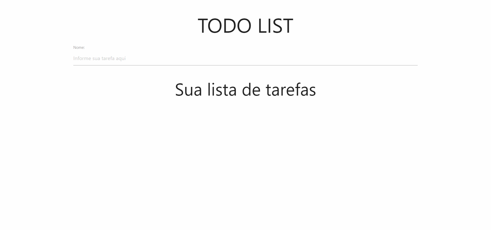

## Manage your daily tasks using TODO LISTS web application

Todo List | Manage your daily tasks using TODO LISTS web application

 
 

 

## Description

Todo List use local storage resource providing you a better experience managing your daily tasks

 

 

## STACK

- Javascript
- HTML
- CSS
- NodeJS

 

<blockquote alt="[ignore]">

This project is free and made for everyone!

</blockquote>

